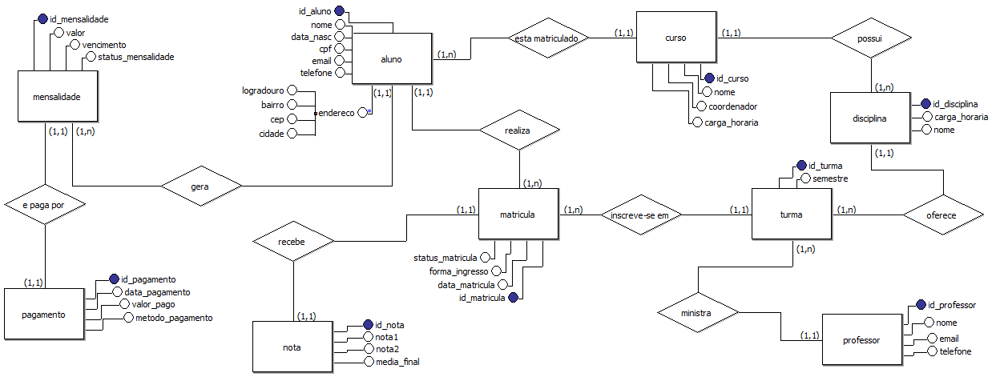
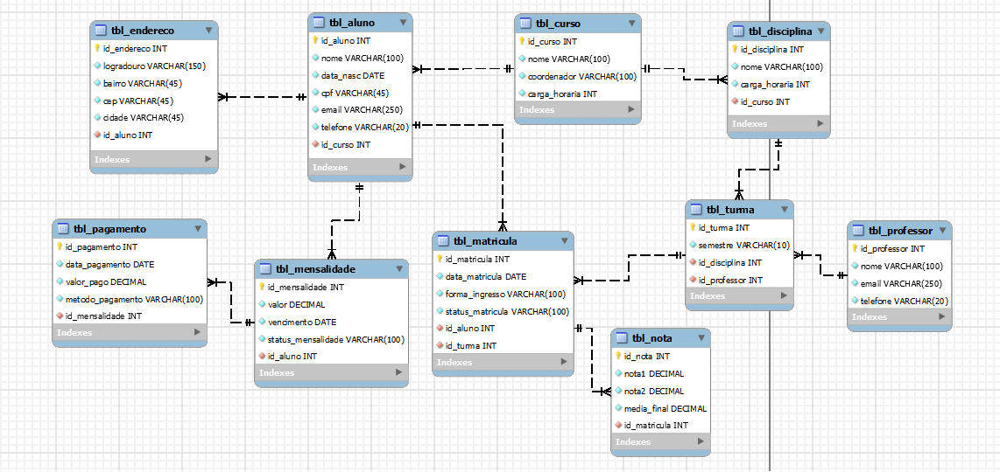

# banco-de-dados-faculdade-winchester
Projeto de banco de dados desenvolvido para um sistema acadêmico de faculdade. Inclui a análise de requisitos, os modelos conceitual, lógico e físico, além do script SQL completo para criação do banco.


## 📌 Análise de Requisitos – Sistema da Faculdade Winchester

### ● Quais são as principais necessidades dos clientes?

Os proprietários da Faculdade Winchester necessitam de um sistema que centralize e organize os dados relacionados à sua instituição. As principais necessidades são:

- Armazenar dados cadastrais de alunos, professores e cursos;
- Controlar disciplinas e turmas ofertadas;
- Registrar matrículas e situação acadêmica dos alunos;
- Armazenar e consultar notas;
- Gerenciar mensalidades e pagamentos.

---

### ● a. Quais informações precisam ser armazenadas?

- **Alunos**: nome, data de nascimento, CPF, e-mail, telefone, curso vinculado e endereço;
- **Professores**: nome, e-mail, telefone;
- **Cursos**: nome, coordenador, carga horária;
- **Disciplinas**: nome, carga horária, curso ao qual pertence;
- **Turmas**: semestre, disciplina ministrada e professor responsável;
- **Matrículas**: data, forma de ingresso, status da matrícula, aluno e turma;
- **Notas**: nota 1, nota 2, média final;
- **Mensalidades**: valor, vencimento, status e aluno vinculado;
- **Pagamentos**: data de pagamento, valor pago, método de pagamento e mensalidade relacionada.

---

### ● b. Quais dados precisam ser guardados?

Além dos dados mencionados, também é necessário armazenar:

- Dados de endereço dos alunos (logradouro, bairro, cidade, CEP);
- Relacionamentos entre entidades, como:
  - Curso do aluno;
  - Disciplinas do curso;
  - Professores responsáveis por turmas;
  - Matrículas de alunos em turmas;
  - Pagamentos vinculados às mensalidades.

---

### ● c. O que será feito com os dados posteriormente?

Os dados armazenados serão utilizados para:

- Consultas administrativas e acadêmicas;
- Controle de desempenho acadêmico dos alunos;
- Geração de boletins e históricos;
- Emissão de boletos/mensalidades;
- Registro e controle de pagamentos;
- Gestão de cursos e alocação de professores.

---

### ● Quais tabelas precisam ser criadas?

Foram criadas as seguintes tabelas:

1. `curso`
2. `professor`
3. `aluno`
4. `endereco`
5. `disciplina`
6. `turma`
7. `matricula`
8. `nota`
9. `mensalidade`
10. `pagamento`

---

### ● Quais atributos cada tabela deve ter?

- **curso**: `id_curso`, `nome`, `coordenador`, `carga_horaria`
- **professor**: `id_professor`, `nome`, `email`, `telefone`
- **aluno**: `id_aluno`, `nome`, `data_nasc`, `cpf`, `email`, `telefone`, `id_curso`
- **endereco**: `id_endereco`, `logradouro`, `bairro`, `cep`, `cidade`, `id_aluno`
- **disciplina**: `id_disciplina`, `nome`, `carga_horaria`, `id_curso`
- **turma**: `id_turma`, `semestre`, `id_disciplina`, `id_professor`
- **matricula**: `id_matricula`, `data_matricula`, `forma_ingresso`, `status_matricula`, `id_aluno`, `id_turma`
- **nota**: `id_nota`, `nota1`, `nota2`, `media_final`, `id_matricula`
- **mensalidade**: `id_mensalidade`, `valor`, `vencimento`, `status_mensalidade`, `id_aluno`
- **pagamento**: `id_pagamento`, `data_pagamento`, `valor_pago`, `metodo_pagamento`, `id_mensalidade`

---

### ● Qual o tipo de dados de cada atributo definido?

- `INTEGER` / `AUTO_INCREMENT` para identificadores;
- `VARCHAR` para nomes, e-mails, telefones, endereços, métodos de pagamento;
- `DATE` para datas (nascimento, matrícula, pagamento);
- `DECIMAL` para valores monetários e notas;
- `FOREIGN KEY` para garantir integridade referencial entre tabelas.

---

### ● Quais são os relacionamentos a serem criados entre as tabelas?

- Um **curso** pode ter vários **alunos** e várias **disciplinas**;
- Um **aluno** pertence a apenas um **curso**;
- Um **aluno** possui um **endereço**;
- Uma **disciplina** pertence a um **curso**;
- Uma **turma** é composta por uma **disciplina** e um **professor**;
- Uma **matrícula** relaciona um **aluno** a uma **turma**;
- Cada **nota** está associada a uma **matrícula**;
- Um **aluno** possui várias **mensalidades**;
- Uma **mensalidade** pode ter um ou mais **pagamentos**.

---

## Modelo Conceitual



---

## Modelo Lógico



---

## Modelo Físico (SQL)

```sql
create database faculdadewinchester;
use faculdadewinchester;

create table curso (
id_curso integer primary key not null unique auto_increment,
nome varchar(100) not null,
coordenador varchar(100) not null,
carga_horaria integer not null
);

create table professor (
id_professor integer primary key not null auto_increment,
nome varchar(100) not null,
email varchar(250) not null,
telefone varchar(20) not null
);

create table aluno (
id_aluno integer primary key not null auto_increment,
nome varchar(100) not null,
data_nasc date not null,
cpf varchar(45) not null unique,
email varchar(250) not null unique,
telefone varchar(20) not null,
id_curso integer not null,
foreign key (id_curso) references curso(id_curso)
);

create table endereco (
id_endereco integer primary key not null auto_increment,
logradouro varchar(150) not null,
bairro varchar(45) not null,
cep varchar(45) not null,
cidade varchar(45) not null,
id_aluno integer not null,
foreign key (id_aluno) references aluno(id_aluno)
);

create table disciplina (
id_disciplina integer primary key not null auto_increment,
nome varchar(100) not null,
carga_horaria integer not null,
id_curso integer not null,
foreign key (id_curso) references curso(id_curso)
);

create table turma (
id_turma integer primary key not null auto_increment,
semestre varchar(10) not null,
id_disciplina integer not null,
id_professor integer not null,
foreign key (id_disciplina) references disciplina(id_disciplina),
foreign key (id_professor) references professor(id_professor)
);

create table matricula (
id_matricula integer primary key not null auto_increment,
data_matricula date not null,
forma_ingresso varchar(100) not null,
status_matricula varchar(100) not null,
id_aluno integer not null,
id_turma integer not null,
foreign key (id_aluno) references aluno(id_aluno),
foreign key (id_turma) references turma(id_turma)
);

create table nota (
id_nota integer primary key not null auto_increment,
nota1 decimal(4,2) not null,
nota2 decimal(4,2) not null,
media_final decimal(4,2) not null,
id_matricula integer not null,
foreign key (id_matricula) references matricula(id_matricula)
);

create table mensalidade (
id_mensalidade integer primary key not null auto_increment,
valor decimal(10,2) not null,
vencimento date not null,
status_mensalidade varchar(100) not null,
id_aluno integer not null,
foreign key (id_aluno) references aluno(id_aluno)
);

create table pagamento (
id_pagamento integer primary key not null auto_increment,
data_pagamento date not null,
valor_pago decimal not null,
metodo_pagamento varchar(100) not null,
id_mensalidade integer not null,
foreign key (id_mensalidade) references mensalidade(id_mensalidade)
);


insert into 
    curso (nome, coordenador, carga_horaria)
values
    ('Ciência da Computação', 'Cisco Ramon', '3220'),
    ('Astronomia', 'Galileu Galilei', '3000'),
    ('Engenharia Elétrica', 'Scott Lang', '4000'),
    ('Arqueologia', 'Lara Croft', '3500'),
    ('Engenharia Mecânica', 'Tony Stark', '4500');
    
insert into
    professor (nome, email, telefone)
values
    ('Alaric Saltzman', 'alaric@gmail.com', '21988887777'),
    ('Charles Xavier', 'xmen@gmail.com', '21988776655'),
    ('Alvo Dumbledore', 'dumbledore@gmail.com', '21977445566'),
    ('Amy Farrah Fowler', 'amy@gmail.com', '21966332244'),
    ('Natasha Romanoff', 'nat@gmail.com', '21955221133');
    
insert into
    aluno (nome, data_nasc, cpf, email, telefone, id_curso)
values
    ('Elena Gilbert', '2000-05-10', '123.456.789-00', 'elena@gmail.com', '21987654321', 1),
    ('Elijah Mikaelson', '2001-08-22', '987.654.321-00', 'elijah@gmail.com', '11976543210', 2),
    ('Stefan Salvatore', '1999-03-15', '456.789.123-00', 'stefan@salvatore', '219881234567', 3),
    ('Erika Fane', '2002-12-05', '789.123.456-00', 'fane@gmail.com', '21998877665', 4),
    ('Nikova Banks', '2001-07-18', '159.357.258-00', 'nikova@gmail.com', '11765432109', 5);
    
insert into
    endereco (logradouro, bairro, cep, cidade, id_aluno)
values
    ('Rua A, 123', 'Centro', '01010-000', 'São Paulo', 1),
    ('Av. B, 456', 'Jardins', '02020-000', 'Rio de Janeiro', 2),
    ('Rua C, 789', 'Bela Vista', '03030-000', 'Belo Horizonte', 3),
    ('Av. D, 321', 'Copacabana', '04040-000', 'Salvador', 4),
    ('Rua E, 654', 'Boa Viagem', '05050-000', 'Recife', 5);
    
insert into
    disciplina (nome, carga_horaria, id_curso)
values
    ('Lógica de Programação', 60, 1),
    ('Astrofísica Estelar', 68, 2),
    ('Circuitos Elétricos', 70, 3),
    ('Técnicas de Escavação', 55, 4),
    ('Robótica', 62, 5);
    
insert into
    turma (semestre, id_disciplina, id_professor)
values
    ('2025/1', 1, 1),
    ('2025/1', 2, 2),
    ('2025/1', 3, 3),
    ('2025/1', 4, 4),
    ('2025/1', 5, 5);
    
insert into
    matricula (data_matricula, forma_ingresso, status_matricula, id_turma, id_aluno)
values
    ('2025-02-01', 'ENEM', 'Ativa', 1, 1),
    ('2025-02-02', 'Vestibular', 'Ativa', 2, 2),
    ('2025-02-03', 'Transferência', 'Ativa', 3, 3),
    ('2025-02-04', 'ENEM', 'Trancada', 4, 4),
    ('2025-02-05', 'Vestibular', 'Cancelada', 5, 5);

insert into
    nota (nota1, nota2, media_final, id_matricula)
values
    (7.5, 8.0, 7.75, 1),
    (6.0, 7.0, 6.5, 2),
    (9.0, 8.5, 8.75, 3),
    (5.0, 6.0, 5.5, 4),
    (4.0, 3.0, 3.5, 5);
    
insert into
    mensalidade (valor, vencimento, status_mensalidade, id_aluno)
values
    (120.00, '2025-03-10', 'Paga', 1),
    (130.00, '2025-03-10', 'Em Aberto', 2),
    (150.00, '2025-03-10', 'Atrasada', 3),
    (140.00, '2025-03-10', 'Paga', 4),
    (160.00, '2025-03-10', 'Em Aberto', 5);
    
insert into
    pagamento (data_pagamento, valor_pago, metodo_pagamento, id_mensalidade)
values
    ('2025-03-01', 120.00, 'Boleto', 1),     -- Paga
    ('2025-03-10', 130.00, 'Cartão', 2),     -- Em Aberto, mas agora paga
    ('2025-03-15', 150.00, 'Pix', 3),         -- Atrasada, mas paga depois
    ('2025-03-09', 140.00, 'Pix', 4),         -- Paga
    ('2025-03-20', 160.00, 'Pix', 5);        -- Em Aberto, mas paga
    


select * from curso;
select * from professor;
select * from aluno;
select * from endereco;
select * from disciplina;
select * from turma;
select * from matricula;
select * from nota;
select * from mensalidade;
select * from pagamento;


show tables;
```
